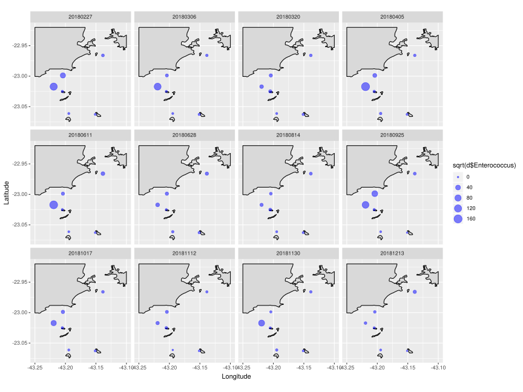

# BacterialIndicators_CoastalRJ

Analysis of the abundance of bacterial indicators of feacal contamination in the coastal waters of Rio de Janeiro, Brasil, and in the Cagarras Islands.

Seawage from the southern zone of the city is discharged by an underwater outlet (30m), proximately 3km away from Ipanema and Leblon beaches.

Seawage from the underwater outlet can reach the beach 

Feacal contamination in surface waters is worse in winter months (June-Aug), when water stratification is disrupted

Measured seawater temperature in the bottom (Fundo) and surface waters (Sup). Data form the outlet is highlghted in red.

The hypereutrophic Guanabara bay (P1) is another source of seawage, although it is more likely that feacal indicators reaching the beaches comes from the underwater outlet.

Enteroccus abundance as a function of distance from the outlet.
