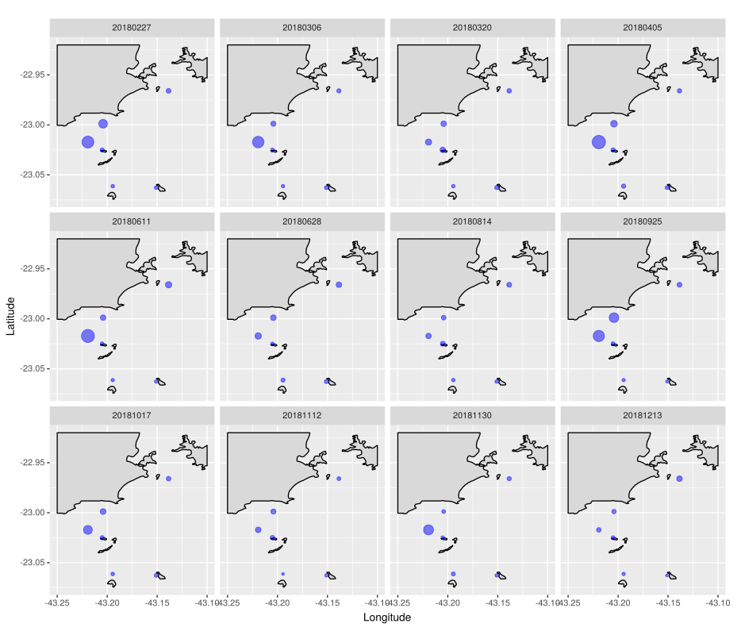
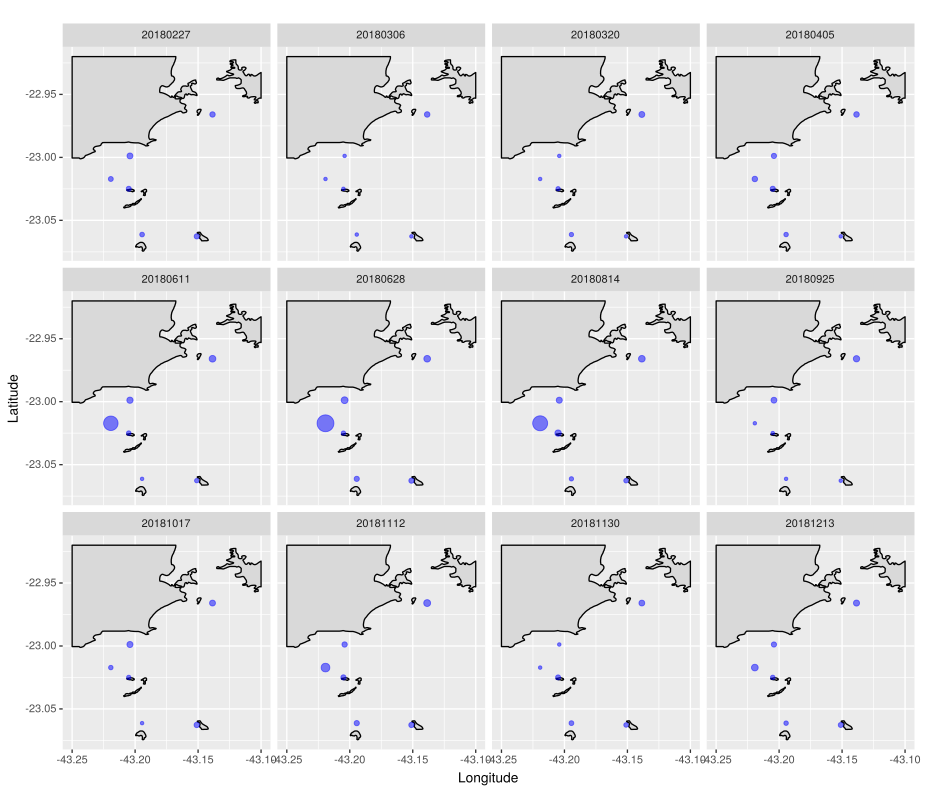
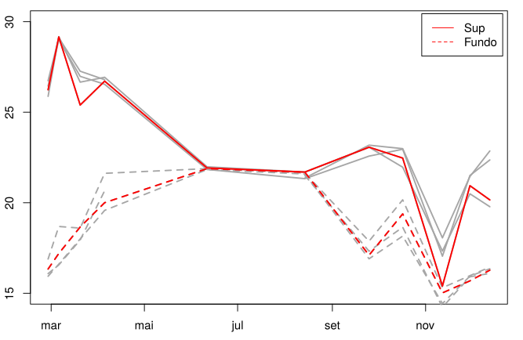
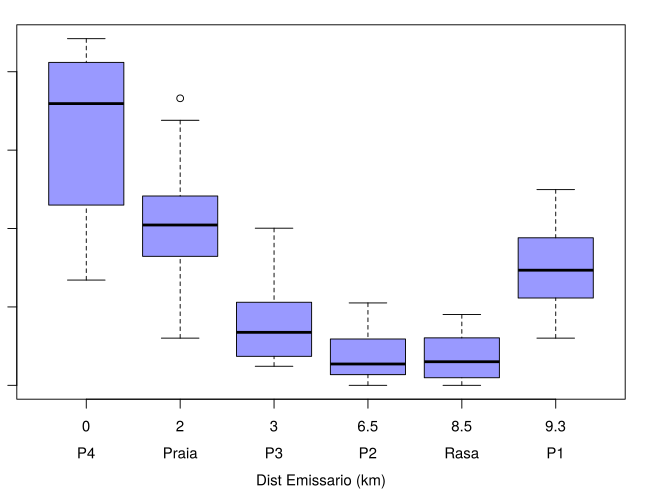

# BacterialIndicators_CoastalRJ

Analysis of the abundance of bacterial indicators of feacal contamination in the coastal waters of Rio de Janeiro, Brasil, and in the Cagarras Islands.

Seawage from the southern zone of the city is discharged by an underwater outlet (30m), proximately 3km away from the recreational beaches of Ipanema and Leblon.

Seawage from the underwater outlet can reach the bottom waters close to the recreational beaches. Below, a map of Enterococcus abundance in bottom waters.

Seawater stratification occurs in the summer (Nov-Mar), when solar incidence is higher and mild eastern winds are dominant. Stratification is disrupted in winter months (June-Aug), when harsh southwestern winds often hits the area. Disrupted water stratification and lower solar irradiance allows the feacal indicators to reach and persist in surface waters. Map of Enterococcus abundance in surface waters:

Measured seawater temperature in bottom (Fundo) and surface waters (Sup). Data from the outlet is highlighted in red.

The hypereutrophic Guanabara Bay (P1) is another source of seawage to the coastal zone, although it is more likely that feacal indicators reaching the beaches (Praia) comes from the underwater outlet. 
Enterococcus abundance as a function of distance from the outlet.

